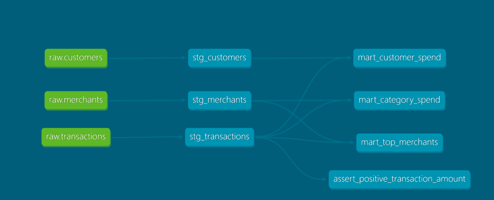

# 💰 FinSight Analytics — dbt + Snowflake ELT Pipeline

<p align="center">
  
  
  
  
  
  
</p>

<p align="center">
  
  
  
  
</p>

---

## 🧠 Problem Statement

A fintech startup — **FinSight Analytics** — ingests raw banking transaction data from multiple customers daily. The raw data is messy: missing merchant references, null customer IDs, duplicate transaction records, and zero business-level aggregations.

**The challenge:** Analysts cannot query raw data reliably. Leadership needs clean, weekly spending summaries per customer to power a personal finance dashboard — think Mint or YNAB.

> **My job:** Design and build a production-grade ELT pipeline that takes raw, dirty transaction data and transforms it into trusted, testable, business-ready finance KPIs using dbt and Snowflake.

---

## 🏗️ Architecture

```
┌─────────────────────────────────────────────────────────────┐
│                    ELT PIPELINE OVERVIEW                     │
├─────────────────┬───────────────────┬───────────────────────┤
│   RAW LAYER     │   STAGING LAYER   │      MARTS LAYER      │
│  (Snowflake)    │     (dbt)         │       (dbt)           │
├─────────────────┼───────────────────┼───────────────────────┤
│ raw.customers   │ stg_customers     │ mart_customer_spend   │
│ raw.merchants   │ stg_merchants     │ mart_category_spend   │
│ raw.transactions│ stg_transactions  │ mart_top_merchants    │
└─────────────────┴───────────────────┴───────────────────────┘
        ↑                  ↑                      ↑
   Load as-is        Clean, type,            Business KPIs
   Never touched     rename, dedupe          for dashboards
```

| Layer | Purpose | Who Touches It |
|---|---|---|
| **Raw** | Exact copy of source data, never modified | Data Engineers (load only) |
| **Staging** | Cleaned, typed, deduplicated, renamed | dbt models |
| **Marts** | Aggregated business metrics and KPIs | dbt models → Analysts / BI tools |

---

## 📊 Finance Domain — KPIs Being Modeled

| KPI | Description |
|---|---|
| **Monthly Spend** | Total outflow per customer per month |
| **Spend by Category** | Breakdown across Groceries, Dining, Travel, Utilities etc. |
| **Average Transaction Value** | Mean spend per transaction per customer |
| **Transaction Volume** | Count of transactions in a given period |
| **Net Cash Flow** | Total credits minus total debits |
| **Top Merchants by Spend** | Ranked merchants by total customer spend |

---

## 🗂️ Project Structure

```
finsight/
├── models/
│   ├── staging/
│   │   ├── stg_customers.sql        # cleaned customer records
│   │   ├── stg_merchants.sql        # cleaned merchant records
│   │   ├── stg_transactions.sql     # cleaned + deduplicated transactions
│   │   └── schema.yml               # source definitions + dbt tests
│   └── marts/
│       ├── mart_customer_spend.sql  # monthly spend per customer
│       ├── mart_category_spend.sql  # spend breakdown by category
│       ├── mart_top_merchants.sql   # top merchants by volume
│       └── schema.yml               # mart-level tests + descriptions
├── seeds/                           # static reference data (if any)
├── tests/                           # custom dbt tests
├── dbt_project.yml                  # dbt project config
└── README.md
```

---

## 🚀 Milestones

### ✅ Milestone 1 — Foundation (Completed)
- [x] Snowflake free tier setup
- [x] Virtual warehouse, database and schemas created (`raw`, `staging`, `marts`)
- [x] Raw tables created and loaded with realistic, intentionally dirty data
- [x] dbt Core + Snowflake adapter installed
- [x] dbt project initialized and connected to Snowflake (`dbt debug` passing)
- [x] GitHub repo initialized with `.gitignore` (credentials excluded)

### ✅ Milestone 2 — Staging Models (Completed)
- [x] `stg_transactions.sql` — deduplicate, cast types, handle nulls
- [x] `stg_customers.sql` — standardize names, filter invalid records
- [x] `stg_merchants.sql` — clean categories, trim whitespace
- [x] `schema.yml` — source definitions and out-of-the-box dbt tests (`not_null`, `unique`)
- [x] Fixed `staging_staging` schema duplication via `generate_schema_name` macro
- [x] `dbt run` + `dbt test` passing 11/11 ✅

### ✅ Milestone 3 — Marts & KPIs (Completed)
- [x] `mart_customer_spend.sql` — monthly spend aggregation per customer
- [x] `mart_category_spend.sql` — spend by merchant category with % breakdown
- [x] `mart_top_merchants.sql` — top merchants ranked by total spend
- [x] `schema.yml` — mart level tests
- [x] Custom dbt test — `assert_positive_transaction_amount`
- [x] `dbt run` PASS 6/6 + `dbt test` PASS 22/22 ✅

### ✅ Milestone 4 — Documentation & Lineage (Completed)
- [x] Column-level descriptions in all `schema.yml` files
- [x] `dbt docs generate` — auto-generated project documentation
- [x] `dbt docs serve` — documentation website with lineage graph
- [x] Full data lineage DAG — raw → staging → marts visualized automatically
- [x] Custom test `assert_positive_transaction_amount` visible in DAG
- [x] DAG screenshot added to README

## 📈 Data Lineage DAG
> Auto-generated by `dbt docs generate` — no manual configuration needed.



### ✅ Milestone 5 — Semi-structured Data (Completed)
- [x] Created `raw.transactions_json` with Snowflake VARIANT column
- [x] Loaded real-world style nested JSON transaction data
- [x] Built `stg_transactions_json.sql` — flattens JSON using `:` and `::` operators
- [x] Extracted nested fields — `customer.id`, `merchant.category`, `metadata.device`
- [x] Added `accepted_values` test for transaction status
- [x] Updated `sources.yml` with new JSON source
- [x] dbt run PASS 7/7 + dbt test PASS 28/28 ✅

### 📋 Milestone 6 — Incremental Models (Planned)
- [ ] Convert `stg_transactions` to incremental materialization
- [ ] Process only new records on each run
- [ ] Understand `is_incremental()` macro
- [ ] Compare full refresh vs incremental run performance
---

## ⚙️ Tech Stack

| Tool | Role |
|---|---|
| **Snowflake** | Cloud data warehouse — stores raw, staging, and marts layers |
| **dbt Core** | Transformation framework — models, tests, documentation |
| **SQL** | Primary transformation language inside dbt models |
| **Python + pip** | dbt installation and virtual environment management |
| **Git + GitHub** | Version control — every model change tracked and reviewable |

---

## 🔑 Why ELT over ETL?

Traditional **ETL** transforms data *before* loading it into the warehouse — the transformation logic lives outside, in Spark jobs or custom scripts nobody can easily audit.

**ELT** loads raw data first, then transforms *inside* the warehouse using dbt:

- ✅ Raw data is always preserved — retransform anytime
- ✅ Transformation logic lives in Git — reviewable, auditable, versioned
- ✅ Snowflake's elastic compute handles heavy transformations cheaply
- ✅ SQL is accessible to analysts, not just engineers
- ✅ dbt tests catch bad data before it reaches dashboards

---

## 🛠️ Local Setup

```bash
# 1. Clone the repo
git clone https://github.com/yourusername/finsight-dbt.git
cd finsight-dbt

# 2. Create and activate virtual environment
python -m venv venv
source venv/bin/activate        # Mac/Linux
venv\Scripts\activate           # Windows

# 3. Install dependencies
pip install dbt-core dbt-snowflake

# 4. Configure your Snowflake credentials
# Create ~/.dbt/profiles.yml (see profiles.yml.example)

# 5. Verify connection
dbt debug

# 6. Run models
dbt run

# 7. Run tests
dbt test
```

> ⚠️ Never commit `profiles.yml` — it contains your Snowflake credentials. It is excluded via `.gitignore`.

---

## 👩‍💻 Author

**Sahithi Morapakala**
Data Engineer | ELT & Analytics Engineering
---

<p align="center">Built with 🔥 to learn dbt the right way — real data, real problems, real pipeline.</p>
